# Instrukcja modułu „BluePayment” dla platformy Magento 2

## Podstawowe informacje
BluePayment to moduł płatności umożliwiający realizację transakcji bezgotówkowych w sklepie opartym na platformie Magento 2.

### Główne funkcje
Do najważniejszych funkcji modułu zalicza się:
- obsługę wielu sklepów jednocześnie z użyciem jednego modułu
- obsługę zakupów bez rejestracji w serwisie
- obsługę dwóch trybów działania – testowego i produkcyjnego (dla każdego z nich wymagane są osobne dane kont, po które zwróć się do nas)
- realizacja dwóch sposobów wyświetlenia form płatności w sklepie:
  - na stronie Blue Media – widok klasyczny lub spersonalizowany (po uzgodnieniu z Blue Media),
  - na stronie sklepu – zintegrowany, klient przenoszony jest od razu do banku lub na stronę płatności kartą.
  
### Wymagania
- Wersja Magento: 2.3.0 – 2.4.5.
- Wersja PHP zgodna z wymaganiami względem danej wersji sklepu.

### [Co nowego w BluePayment?](CHANGELOG.md)

## Instalacja

### Poprzez composera
1. Wykonaj komendę:
```
composer require bluepayment-plugin/module-bluepayment
```
2. Przejdź do aktywacji modułu

### Poprzez paczkę .zip
1. Pobierz najnowszą wersję modułu z tej [strony](https://github.com/bluepayment-plugin/magento-2.x-plugin/archive/refs/heads/master.zip).
2. Wgraj plik .zip do katalogu głównego Magento.
3. Będąc w katalogu głównym Magento, wykonaj komendę:
```bash
unzip -o -d app/code/BlueMedia/BluePayment bm-bluepayment-*.zip && rm bm-bluepayment-*.zip
```
4. Przejdź do aktywacji modułu.


## Aktywacja modułu

### Aktywacja za pomocą linii poleceń
1. Będąc w katalogu głównym Magento, wykonaj następujące polecenia:
- `bin/magento module:enable BlueMedia_BluePayment --clear-static-content`
- `bin/magento setup:upgrade`
- `bin/magento setup:di:compile`
- `bin/magento cache:flush`  
, a moduł zostanie aktywowany.

### Aktywacja za pośrednictwem panelu administracyjnego (tylko do wersji Magento 2.3)
1. Zaloguj się do panelu administracyjnego Magento.
2. Wybierz z menu głównego **System** -> **Web Setup Wizard**. System poprosi Cię o ponowne zalogowanie się - zrób to, żeby kontynuować aktywację.
3. Przejdź do **Component Manager**, znajdź na liście moduł **BlueMedia/BluePayment**, kliknij **Select** i następnie **Enable**.
   
   
4. Kliknij **Start Readiness Check**, żeby zainicjować wykonanie weryfikacji zależności, po czym kliknij **Next**.
5. Jeżeli chcesz, możesz w tym momencie utworzyć kopię zapasową kodu, mediów i bazy danych, klikając **Create Backup**. Następnie kliknij **Next**

   
6. Kliknij **Enable**, żeby wyłączyć swój sklep internetowy na czas aktywacji bramki płatności.
7. Aktywacja może potrwać kilka minut. Gdy zakończy się sukcesem, zobaczysz następujący komunikat:
   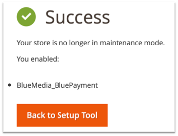


## Konfiguracja
1. Zaloguj się do panelu administracyjnego w platformie Magento 2.
2. Wybierz z menu: **Sklepy (Store)** -> **Konfiguracja (Configuration)**
3. W kolejnym menu wybierz: **Sprzedaż (Sales)** -> **Metody płatności (Payments methods)**
4. Następnie rozwiń **Inne metody płatności (Other payment methods)** i wybierz **Płatność online BM (Online Payment BM)**. 

### Podstawowa konfiguracja modułu
1. Przejdź do [Konfiguracji modułu](#konfiguracja).
2. Wypełnij obowiązkowe pola:
    1. Przy statusie **Włączony (Enabled)** kliknij **Tak (Yes)**.
    2. Uzupełnij **Tytuł (Title)** – czyli nazwę płatności widoczną dla klientów Twojego sklepu – może brzmieć np. Bezpieczna płatność online. 
    3. Ustaw **Tryb testowy (Test Mode)**
3. Uzupełnij dane dotyczące obsługiwanych walut (otrzymasz je od Blue Media)
   1. **ID serwisu (Service partner ID)**
   2. **Klucz konfiguracyjny (hash) (Configuration key (hash))** - otrzymasz go od BM, możesz go odczytać także w panelu PayBM [Środowisko akceptacyjne](https://oplacasie-accept.bm.pl/admin), [Środowisko produkcyjne](https://oplacasie.bm.pl/admin) w szczegółach serwisu, jako **Klucz konfiguracyjny (hash)**
      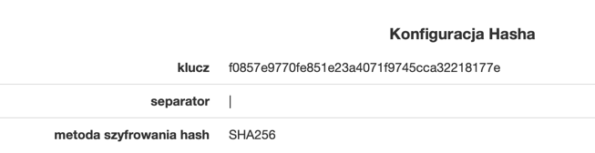
4. [Odśwież pamięć podręczną.](#odświeżenie-pamięci-podręcznej)

### Konfiguracja kanałów płatności
1. Zaloguj się do panelu administracyjnego w platformie Magento 2
2. Wybierz z menu po lewej stronie **BluePayment** -> **Kanały płatności (Gateways)**

#### Wybór kanału płatności w sklepie
1. Przejdź do [Konfiguracji modułu](#konfiguracja)
2. Zaznacz **Tak (whitelabel) (YES (whitelabel)** przy polu **Pokaż kanały płatności w sklepie (Show payment gateways in store)**
3. [Odśwież pamięć podręczną.](#odświeżenie-pamięci-podręcznej)

#### Odświeżenie listy kanałów płatności
1. Przejdź do Listy kanałów płatności
2. Kliknij komendę **Synchronizuj kanały płatności (Synchronize Gateways)**, którą znajdziesz po prawej stronie ekranu.

Moduł umożliwia automatyczne odświeżanie kanału płatności co 5 minut. Żeby korzystać z tej możliwości – skonfiguruj CRON-a, zgodnie z dokumentacją Magento dostępną pod [tym linkiem](https://devdocs.magento.com/guides/v2.4/config-guide/cli/config-cli-subcommands-cron.html).

#### Edycja kanałów płatności
1. Przejdź do Listy kanałów płatności.
2. Kliknij w nazwę kanału, który chcesz edytować
3. Możesz wyedytować następujące dane:
    1. **Status kanału (Status)** – czy kanał jest aktualnie dostępny (jeżeli CRON jest poprawnie skonfigurowany - odświeżanie kanałów następuje co 5 minut);
    2. (informacyjnie) **Waluta (Currency)**
    3. (informacyjnie) **ID**
    4. (informacyjnie) **Nazwa banku (Bank Name)**
    5. (informacyjnie) **Nazwa (Name)**
    6. (informacyjnie) **Maksymalna kwota płatności (Maximum payment amount)**
    7. (informacyjnie) **Minimalna kwota płatności (Minimum payment amount)**
    8. **Opis (Description)** – wyświetlany klientowi pod nazwą kanału płatności
    9. **Kolejność (Sort Order)** – kolejność sortowania na liście kanałów, gdzie:
        - 1 – pierwsza pozycja na liście,
        - 2 – druga pozycja na liście,
        - ...
        - 0 – ostatnia pozycja na liście.
    10. **Rodzaj (Type)**.
    11. **Traktuj jako oddzielną metodę płatności (Is separated method)** – powoduje wyświetlanie danego kanału jako osobnej metody płatności. _BLIK, Karty płatnicze oraz kanały ratalne są zawsze wyświetlane jako osobne metody płatności._
    12. **Gateway Logo**
    13. **Użyj własnego logo (Use Own Logo)** dla kanału płatności 
    14. **Ścieżka do logo (Logo Path)** – adres do własnego logo (widoczne przy zaznaczeniu opcji **Użyj własnego logo (Use Own Logo)**)
    15. (informacyjnie) **Data ostatniego odświeżenia (Status Date)** – data i czas ostatniej aktualizacji danych dotyczących kanału płatności
    16. **Wymuś wyłączenie (Force Disable)** – umożliwia dezaktywację wybranego kanału płatności (bez względu na **Status kanału (Status)**)

### Rozwijalna lista kanałów
Opcja dostępna od wersji 2.9.0 - **domyślnie włączona**.

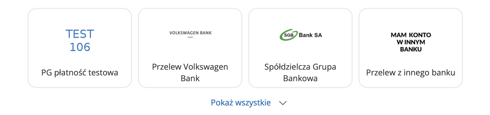

Jeżeli chcesz zawsze wyświetlać pełną listę kanałów płatności:
1. Przejdź do [Konfiguracji modułu](#konfiguracja)
2. Kliknij **Wyłącz (Disabled)** w polu **Zwijalna lista kanałów (Collapsible gateway list)**
3. [Odśwież pamięć podręczną.](#odświeżenie-pamięci-podręcznej)

### Odświeżenie pamięci podręcznej
Odśwież pamięć podręczną po każdej edycji konfiguracji. Żeby to zrobić:
1. Przejdź do **System** -> **Pamięć podręczna (Cache Management)**
2. Zaznacz **Konfiguracja (Configuration)**
3. Wybierz **Odśwież (Refresh)** z rowijanego menu
4. Kliknij **Wyślij (Submit)**
   
   

## Płatność w iFrame
Opcja, która umożliwia klientom dokonanie płatności kartą bez wychodzenia ze sklepu i opuszczania procesu zakupowego. Implementacja tej formy płatności, ze względu na wymogi związane z bezpieczeństwem procesowania transakcji, wymaga dwóch dodatkowych dokumentów: SAQ A oraz audyt strony.


### Aktywacja płatności iFrame
1. Przejdź do [Konfiguracji modułu](#konfiguracja)
2. Kliknij **Włącz (Enable)** przy opcji **Płatność w iFrame (Iframe Payment)**.
3. Przejdź do edycji kanału o ID *1500* i nazwie banku *Karty*.
4. Ustaw opcję **Traktuj jako oddzielną metodę płatności (Is separated method)**.
5. [Odśwież pamięć podręczną.](#odświeżenie-pamięci-podręcznej)


## BLIK 0
BLIK "wewnątrz sklepu" cechuje się tym, że kod zabezpieczający transakcję należy wpisać bezpośrednio na stronie sklepu – w ostatnim etapie procesu zakupowego.

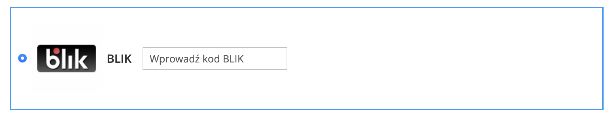

### Aktywacja BLIK 0
1. Przejdź do [Konfiguracji modułu](#konfiguracja)
2. Kliknij **Włącz (Enable)** przy opcji **BLIK 0**.
3. Przejdź do edycji kanału o ID *509* i nazwie kanału *BLIK*.
4. Ustaw opcję **Traktuj jako oddzielną metodę płatności (Is separated method)**.
5. [Odśwież pamięć podręczną.](#odświeżenie-pamięci-podręcznej)


## Google Pay
Opcja umożliwia dokonanie płatności z użyciem Google Pay bezpośrednio na stronie sklepu – w ostatnim etapie procesu zakupowego.


### Aktywacja Google Pay
Google Pay jest **domyślnie aktywowana i zawsze wyświetlana** jako osobna metoda płatności.


## Płatności automatyczne

Płatności jednym kliknięciem – **One Click Payment** – to kolejny sposób na wygodne płatności z wykorzystaniem kart płatniczych. Pozwalają na realizowanie szybkich płatności, bez konieczności każdorazowego podawania przez klienta wszystkich danych uwierzytelniających kartę. Proces obsługi płatności polega na jednorazowej autoryzacji płatności kartą i przypisaniu danych karty do konkretnego klienta. Pierwsza transakcja zabezpieczona jest protokołem 3D-Secure, natomiast kolejne realizowane są na podstawie przesłanego przez partnera żądania obciążenia karty.

Płatność automatyczna dostępna jest tylko dla zalogowanych klientów Twojego sklepu.

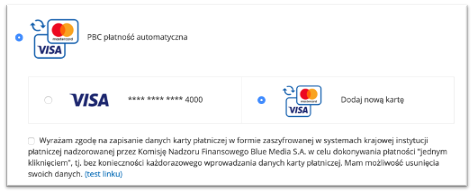

### Aktywacja płatności automatycznych
1. Przejdź do **konfiguracji modułu**.
2. Wypełnij **Autopay Agreement** odpowiednim regulaminem – do akceptacji przez klienta.
3. Przejdź do edycji kanału o ID *1503* i rodzaju *Płatność automatyczna*.
4. Ustaw opcję **Traktuj jako oddzielną metodę płatności (Is separated method)**.
5. [Odśwież pamięć podręczną.](#odświeżenie-pamięci-podręcznej)

### Zarządzanie kartami
Karta płatnicza zostanie zapamiętana i powiązana z kontem klienta podczas pierwszej poprawnie wykonanej transakcji z wykorzystaniem płatności automatycznej i zaakceptowaniu regulaminu usługi.

Klient może usunąć zapamiętane karty z poziomu swojego konta w Twoim sklepie internetowym – musi jedynie:
1. Zalogować się
2. Wybrać **Moje konto (My account)** z górnego menu
3. Wybrać **Zapisane karty płatnicze (Saved payment cards)** z menu po lewej stronie. Wówczas wyświetli się lista zapisanych kart:
   
5. Kliknąć **Usuń** i potwierdzić

## Generowanie zamówień z poziomu panelu administracyjnego
Moduł umożliwia wysłanie linka do płatności do klienta w przypadku zamówień utworzonych bezpośrednio w panelu administracyjnym. W tym celu, należy przy tworzeniu zamówienia wybrać kanał płatności BM.

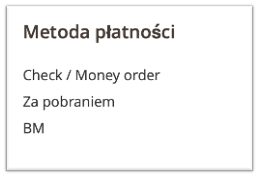

Link do płatności zostanie przesłany przez BM na adres mailowy widoczny w danych klienta.


## Szablony e-mail
Dla wiadomości:
- email_creditmemo_set_template_vars_before
- email_invoice_set_template_vars_before
- email_order_set_template_vars_before
- email_shipment_set_template_vars_before
moduł rozszerza listę dostępnych zmiennych o **payment_channel**. Przykładowe użycie w szablonie:
`{{var payment_channel|raw}}`

## Strona oczekiwania na przekierowanie
Moduł umożliwia dodanie strony pośredniej, wyświetlanej przed samym przekierowaniem użytkownika do płatności. Funkcję tę można wykorzystać np. do śledzenia e-commerce w Google Analytics.

Wykorzystywany szablon: `view/frontend/template/redirect.phtml`

### Aktywacja
Żeby aktywować stronę oczekiwania na przekierowanie:

1. Przejdź do [Konfiguracji modułu](#konfiguracja)
2. Ustaw **Włącz (Enable)** przy opcji **Pokaż stronę przekierowania (Show waiting page before redirect)**
3. Ustaw opcję **Sekund oczekiwania przed przekierowaniem (Seconds to wait before redirect)** – w celu określenia jak długo strona ma być wyświetlana.
4. [Odśwież pamięć podręczną.](#odświeżenie-pamięci-podręcznej)

## Zwroty
Moduł umożliwia zwrot pieniędzy bezpośrednio na rachunek klienta, z którego została nadana płatność, poprzez fakturę korygującą (**Credit Memo on-line**) oraz bezpośrednio z zamówienia.

### Zwrot poprzez fakturę korygującą
Żeby zlecić zwrot w ten sposób:
1. Przejdź do szczegółów **Faktury (Invoice)** dla zamówienia.
2. Naciśnij **Faktura korygująca (Credit Memo)** w górnym menu.
3. Uzupełnij formularz, podając ilość przedmiotów do zwrotu oraz wysokość opłat.
4. Naciśnij **Zwróć (Refund)**, żeby potwierdzić operację.

Zwrot wygeneruje się automatycznie.

### Zwrot bezpośredni
Opcja umożliwia zwrot pieniędzy bezpośrednio na rachunek klienta, z którego została nadana płatność. Żeby z niej skorzystać:

1. Przejdź do [Konfiguracji modułu](#konfiguracja) i zaznacz **Włącz (Enable)** przy opcji **Pokaż ręczny zwrot BM w szczegółach zamówienia (Show manual BM refund in order details)**. Dzięki temu opcja ta będzie dostępna dla wszystkich zakończonych zamówień opłaconych poprzez ten moduł.
2. Następnie przejdź do szczegółów zamówienia.
3. Jeżeli zamówienie zostało opłacone z wykorzystaniem metody płatności BM, w górnym menu powinien być widoczny przycisk Zwrot BM.\

   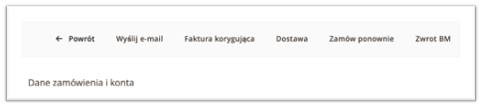
4. Po jego naciśnięciu zobaczysz okno umożliwiające dokonanie pełnego lub częściowego zwrotu.
    1. W przypadku zwrotu częściowego wpisz kwotę w formacie "000.00" (kropka jako separator dziesiętny)
5. Potwierdź zlecenie zwrotu klikając **OK**, a pojawi się komunikat z potwierdzeniem wykonania zwrotu lub powodem, dla którego się nie powiódł
6. Informacje dot. zwrotu są widoczne:
   1. w komentarzach do zamówienia
   
      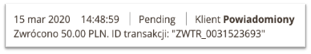
   2. na liście transakcji
   
      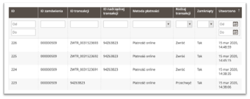


## Dostawa na wiele adresów (multishipping)
Moduł umożliwia opłacenie zamówień złożonych z wykorzystaniem funkcjonalności multishipping.
Konfiguracja dostawy zgodnie z [instrukcją w dokumentacji](https://docs.magento.com/user-guide/configuration/sales/multishipping-settings.html)

Sam moduł płatności nie wymaga żadnych dodatkowych czynności. Płatności BM będą dostępne od razu.

**UWAGA!**

Moduł w trybie multishipping obsługuje TYLKO wyświetlanie dostępnych kanałów płatności na stronie sklepu oraz płatności automatyczne. Nie ma możliwości uruchomienia płatności iFrame, Google Pay i BLIK 0.
Dla zamówień multishipping, OrderID w wiadomościach do klienta oraz w panelu oplacasie.bm.pl będzie numerem koszyka z przedrostkiem QUOTE_, nie numerem zamówienia.

## Informacje o płatności
Informacja o wybranym przez klienta kanale płatności jest widoczna z poziomu listy zamówień (Order grid).  
W tym celu dodaj do widoku kolumnę **Kanał płatności (Payment Channel)**.  
Informacja tekstowa o kanale płatności będzie widoczna w tabeli.

Informacje o wybranym kanale płatności zapisane są w bazie danych:
- w kolumnach **blue_gateway_id** (id kanału) i **payment_channel** (nazwa kanału) w tabeli **sales_order**,
- w kolumnie **payment_channel** (nazwa kanału) w tabeli **sales_order_grid**.

## Rozszerzona Analityka – Google Analytics 4 e-commerce
Opcja dostępna od wersji 2.19.0.

**Dzięki temu rozwiązaniu, możesz dokładniej analizować ścieżkę zakupową Twoich klientów.**  
Po dokonaniu poniższej konfiguracji, **Google Analytics** zacznie zbierać szczegółowe dane na temat zachowań użytkowników.

Moduł dodaje obsługę dodatkowych zdarzeń w Google Analytics 4:
- **view_item_list** – użytkownik zobaczył produkt na liście,
- **view_item** – użytkownik wyświetlił stronę produktu,
- **add_to_cart** – użytkownik dodał produkt do koszyka,
- **remove_from_cart** – użytkownik usunął produkt z koszyka,
- **begin_checkout** – użytkownik rozpoczął proces zamówienia (koszyk i/lub wybór metody dostawy),
- **checkout_progress** – użytkownik przeszedł do drugiego kroku zamówienia (wybór metody płatności),
- **set_checkout_option** – użytkownik uzupełnił dane zamówienia,
- **purchase** – użytkownik złożył zamówienie **oraz opłacił je poprzez płatność BlueMedia** (oznaczenie jako konwersja).

### Utworzenie nowego klucza API Google Analytics
1. Przejdź do [Google Analytics](http://analytics.google.com).
2. Przejdź do **Administracja (Admin)**.
3. Wybierz odpowiednie konto oraz usługę.
4. Kliknij **Strumienie danych (Streams)**.  
   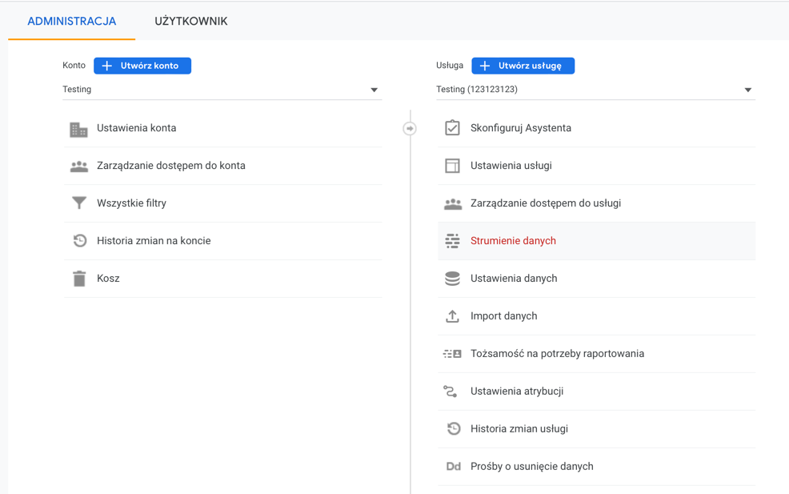
5. Kliknij odpowiedni stream, który jest przypisany do Twojego sklepu. 
   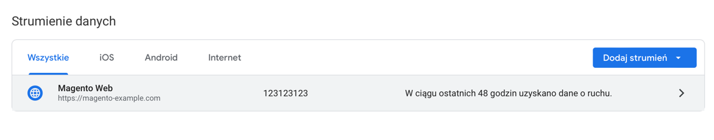
   i. Jeśli nie utworzyłeś wcześniej streamu, możesz to zrobić klikając w przycisk **Dodaj strumień (Add stream)** -> **Sieć (Web)** -> Uzupełnij adres URL sklepu, nazwę strumienia i następnie kliknij **Utwórz strumień (Create stream)**.
6. Wybierz **Tajne klucze API platformy Measurement Protocol (Measurement Protocol)** (w tabeli **Ustawienia dodatkowe**).
   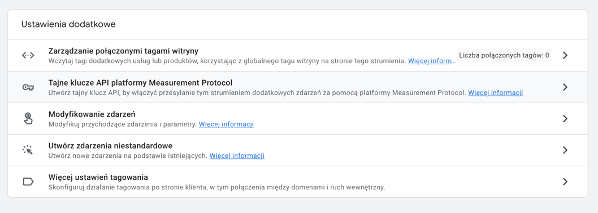
7. Kliknij **Utwórz (Create)**.

### Konfiguracja Google Analytics
1. Wybierz z menu **Sklepy (Stores)** -> **Konfiguracja (Configuration)** -> **Sprzedaż (Sales)** -> **Google API**.    
   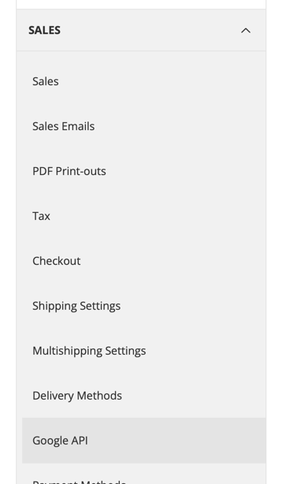
2. Zaznacz opcję **Włączony (Enabled)** na **Tak (Yes)**.
3. Wprowadź kod śledzenia w polu **Account Number (GA4)** (w formacie G-XXXXXXXXXX).
4. Wprowadź **API Secret** wygenerowany zgodnie z instrukcją powyżej.  
   
5. Kliknij **Zapisz konfigurację (Save Config)**.
6. [Odśwież pamięć podręczną.](#odświeżenie-pamięci-podręcznej)


## Wywoływanie eventów
Opcja dostępna od wersji 2.19.0.

Po otrzymaniu nowego statusu płatności - wywoływany jest jeden z eventów:
- `bluemedia_payment_failure` – płatność zakończona niepowodzeniem,
- `bluemedia_payment_pending` – płatność oczekująca,
- `bluemedia_payment_success` – płatność zakończona sukcesem.

Eventy uruchamiane są po zapisaniu nowego statusu zamówienia.  
W ramach eventu, przekazywane są dane:
- `order` – instancja `\Magento\Sales\Model\Order`
- `payment` – instancja `\Magento\Sales\Model\OrderPayment`
- `transaction_id` – identyfikator transakcji w systemie BlueMedia (`string`)


## Promowanie płatności odroczonych / na raty

### Dlaczego warto promować?
- Większa sprzedaż 
- Mniej porzuconych koszyków
- Więcej klientów

Klienci chętniej zdecydują się na zakup produktów, nawet w wyższej cenie, jeśli będą mogli zapłacić później lub rozłożyć spłatę na raty.


Opcja dostępna tylko w przypadku, gdy dla danego serwisu są dostępne płatności **Kup teraz, zapłać później** (Smartney), **Alior Raty** lub **Kup na dopasowane raty**.    
Opcja jest uruchamiana automatycznie tylko dla nowych instalacji modułu – w przypadku aktualizacji, należy przejść do ręcznej konfiguracji.

### Konfiguracja
1. Przejdź do [Konfiguracji modułu](#konfiguracja).
2. W zakładce **Promowanie płatności (Promoting payments)** określ, w których miejscach promowane płatności mają być wyświetlane.
   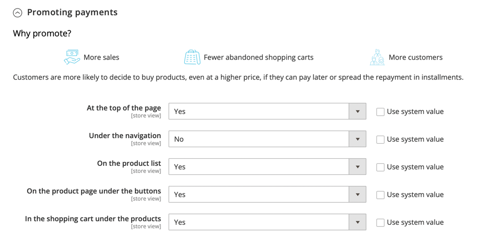

### Przykładowa wizualizacja
**Na górze strony (At the top of the page)**  


**Pod nawigacją (Under the navigation)**  


**Na liście produktów (On the product list)**   


**Na stronie produktu pod przyciskami (On the product page under the buttons)**  


**W koszyku pod produktami (In the shopping cart under the products)**  


## Obsługa GraphQL oraz integracja z Magento PWA
Istnieje możliwość integracji tego rozwiązania z naszą wtyczką. Szczegóły znajdziesz w rozdziale poświęconym [GraphQL](https://developers.bluemedia.pl/online/wtyczki/magento-2/pwa-studio) oraz [Magento PWA](https://developers.bluemedia.pl/online/wtyczki/magento-2/graphql).


## Aktualizacja

### Przez composera
1. Wykonaj komendę
```bash
composer update bluepayment-plugin/module-bluepayment
bin/magento setup:upgrade
bin/magento setup:di:compile
bin/magento cache:flush
```

### Przez paczkę .zip
1. Pobierz najnowszą wersję wtyczki z tej [strony](https://github.com/bluepayment-plugin/magento-2.x-plugin/archive/refs/heads/master.zip).
2. Wgraj plik .zip do katalogu głównego Magento
3. Będąc w katalogu głównym Magento, wykonaj następujące komendy:
```bash
unzip -o -d app/code/BlueMedia/BluePayment bm-bluepayment-*.zip && rm bm-bluepayment-*.zip
bin/magento setup:upgrade
bin/magento setup:di:compile
bin/magento cache:flush
```
4. Moduł jest już aktywny.

## Dezaktywacja modułu

### Dezaktywacja za pomocą linii poleceń
1. Będąc w katalogu głównym Magento, wykonaj następujące polecenia:
```bash
bin/magento module:disable BlueMedia_BluePayment --clear-static-content
bin/magento setup:upgrade
bin/magento setup:di:compile
bin/magento cache:flush
```

### Dezaktywacja za pośrednictwem panelu administracyjnego (tylko do wersji Magneto 2.3)
1. Będąc zalogowanym do panelu administracyjnego, wybierz z menu głównego **System** -> **Web Setup Wizard**. System poprosi Cię o ponowne zalogowanie się.
2. Przejdź do **Menadżera komponentów (Component Manager)** i znajdź na liście moduł **BlueMedia/BluePayment** i kliknij **Select**, a póżniej **Disable**.

   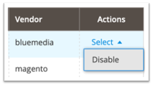
3. Kliknij **Start Readiness Check**, żeby zainicjować wykonanie weryfikacji zależności, po czym kliknij **Next**. 
4. Jeżeli chcesz, możesz w tym momencie utworzyć kopię zapasową kodu, mediów i bazy danych, klikając **Create Backup**.

   
5. Po wykonaniu backupu (lub odznaczeniu tej opcji) – kliknij **Next**, żeby przejść dalej.
6. Kliknij **Disable**, żeby wyłączyć sklep na czas dezaktywacji modułu.
7. Dezaktywacja może potrwać kilka minut. Gdy zakończy się sukcesem, zobaczysz następujący komunikat:
   

### Czyszczenie plików oraz bazy danych (opcjonalnie)
1. Będąc w katalogu głównym Magento – usuń katalog: `app/code/BlueMedia`
2. Wykonaj następujące zapytania do bazy danych:
```sql
DROP TABLE blue_card;
DROP TABLE blue_gateway;
DROP TABLE blue_refund;
DROP TABLE blue_transaction;
```
3. Żeby usunąć całą konfigurację modułu - wykonaj następujące zapytanie do bazy danych:
```sql
DELETE FROM core_config_data WHERE path LIKE 'payment/bluepayment%';
```
