# The manual of „BluePayment” module for Magento 2

## Basic information
The Blue Media Online Payment Plugin for Magento is the easiest way to allow your online store customers use the most popular payment methods. When integrated with the store, the plugin offers the possibility to add over 400 banks to the payment options.

### Main functions

The main functions of the module include:
- support of many stores simultaneously using one module
- support for shopping without registering on the site
- support of two modes of operation - test and production (for each of them separate account data are required, which you should ask us for)
- implementation of two ways to display forms of payment in the store:
  - on the Blue Media site - classic or personalized view (after agreement with Blue Media),
  - on the store page - integrated, the customer is taken straight to the bank or card payment page.


### Requirements
- Magento version: 2.3.0 - 2.4.5.
- PHP version according to the requirements of your store version.

### [What's new in BluePayment?](CHANGELOG_EN.md)

## Installation

### With composer
1. Execute the command:
```
composer require bluepayment-plugin/module-bluepayment
```
2. Activate the module

### Via the zip package
1. Download the latest version of the module from this [site](https://github.com/bluepayment-plugin/magento-2.x-plugin/archive/refs/heads/master.zip).
2. Upload the .zip file to your Magento root directory.
3. While in the Magento root directory, run the command:
```bash
unzip -o -d app/code/BlueMedia/BluePayment bm-bluepayment-*.zip && rm bm-bluepayment-*.zip
```
4. Proceed to activate the module.


## Activating the module

### Activate using the command line
1. While in the Magento root directory, run the following commands:
- `bin/magento module:enable BlueMedia_BluePayment --clear-static-content`
- `bin/magento setup:upgrade`
- `bin/magento setup:di:compile`
- `bin/magento cache:flush`  
and the module will be activated.

### Activation via admin panel (only up to Magento 2.3 version)
1. Log in to the Magento admin panel.
3. Choose **System** -> **Web Setup Wizard** from the main menu. The system will ask you to log in again - do this to continue the activation.
4. Go to **Component Manager**, find the **BlueMedia/BluePayment** module in the list, click **Select** and then **Enable**.
   
   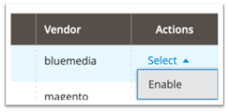
5. Click **Start Readiness Check** to initiate the dependency check execution, then click **Next**.
6. If you wish, you can back up your code, media and database at this point by clicking **Create Backup**. Then click **Next**.

   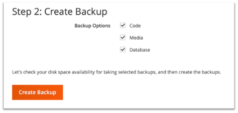
7. Click **Enable** to disable your online store while the payment gateway is activated..
8. Activation may take a few minutes. When it is successful, you will see the following message:
   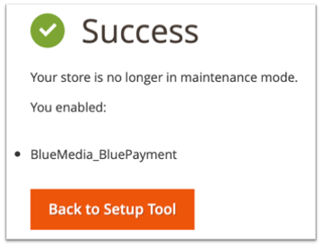


## Configuration
1. Log in to the admin panel in the Magento 2 platform.
2. Choose from the menu: **Store** -> **Configuration**.
3. In the next menu select: **Sales** -> **Payments methods**.
4. Next, expand **Other payment methods** and select **Online Payment BM**. 

### Basic module configuration
1. Go to [Module configuration](#configuration).
2. Fill in the mandatory fields:
   1. Set **Enabled** to **Yes**.
   2. Fill **Title** – the name of the payment visible to your customers - it can be for example Secure Online Payment. 
   3. Set the **Test Mode**
3. Fill in the details of supported currencies (you will receive them from Blue Media)
   1. **Service partner ID**
   2. **Configuration key (hash)** - you will receive it from BM, you can also read it in the PayBM panel [Acceptance Environment](https://oplacasie-accept.bm.pl/admin), [Production Environment](https://oplacasie.bm.pl/admin) in the service details as **Klucz konfiguracyjny (hash)**
      
4. [Refresh cache](#refresh-cache)

### Configure payment channels
1. Log in to the administration panel in Magento 2 platform.
2. Choose **BluePayment** -> **Gateways** from the left side menu.

#### Payment channel selection in store
1. Go to [Module configuration](#configuration).
2. Set **Yes (whitelabel)** for **Show payment gateways in store**.
3. [Refresh cache](#refresh-cache)

#### Refresh the list of payment channels

1. Go to List of Payment Gateways.
2. Click the **Synchronize Gateways** command found on the right side of the screen.

The module allows you to automatically refresh the payment channel every 5 minutes. To use this feature - configure CRON, according to Magento documentation available at [this link](https://devdocs.magento.com/guides/v2.4/config-guide/cli/config-cli-subcommands-cron.html).


#### Editing payment channels
1. Go to the list of Payment Channels.
2. Click on the name of the channel you want to edit.
3. You can edit the following data:
    1. **Status** – whether the channel is currently available (if CRON is configured correctly - channels are refreshed every 5 minutes);
    2. (informative) **Currency**
    3. (informative) **ID**
    4. (informative) **Bank Name**
    5. (informative) **Name**
    6. (informative) **Maximum payment amount**
    7. (informative) **Minimum payment amount**
    8. **Description** – displayed to the customer below the payment channel name
    9. **Sort Order** – the sort order in the list of channels, where:
        - 1 – first position in the list,
        - 2 – second position in the list,
        - ...
        - 0 – the position in the list.
    10. **Type**.
    11. **Is separated method** – displays the channel as a separate payment method
    12. (informative) **Gateway Logo**
    13. **Use Own Logo** for payment channel 
    14. **Logo Path** – address to your own logo (visible when **Use Own Logo** is checked)
    15. (informative) **Status Date** – date and time the payment channel data was last updated
    16. **Force Disable** – enables deactivation of the selected payment channel (regardless of **Status**)

### Expandable channel list

Option available since version 2.9.0 - **default on**.

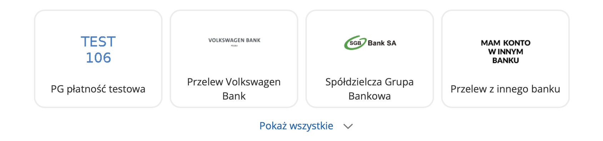

If you want to always display the full list of payment channels:
1. Go to [Module configuration](#configuration).
2. Select **Disabled** for **Collapsible gateway list** option.
3. [Refresh cache](#refresh-cache)

### Refresh cache
Refresh the cache after each configuration edit. To do this:
1. Go to **System** -> **Cache Management**.
2. Check **Configuration** checkbox.
3. Select **Refresh** from the pull-down menu.
4. Click **Submit**
   
   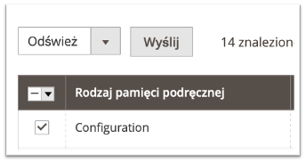


## iFrame payment
An option that allows customers to make a card payment without leaving the store and leaving the shopping process. The implementation of this form of payment, due to the requirements related to the security of the transaction processing, requires two additional documents: SAQ A and a site audit.

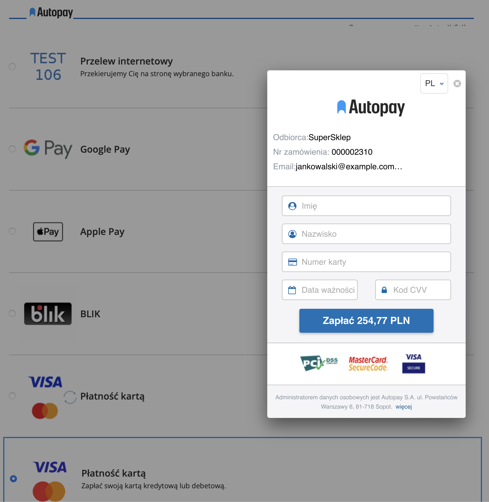

### Activate iFrame payments
1. Go to [Module configuration](#configuration).
2. Select **Enable** for **Iframe Payment** option.
3. Go to edit the channel with ID *1500* and bank name *Karty*.
4. Check **Is separated method** option.
5. [Refresh cache](#refresh-cache)

## BLIK 0
BLIK "in-store" is characterized by the fact that the transaction security code must be entered directly on the store's website - in the last step of the shopping process.

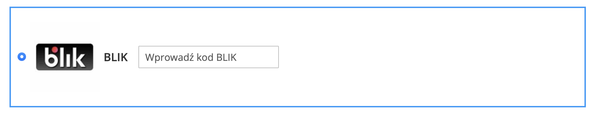

### BLIK 0 activation
1. Go to [Module configuration](#configuration).
2. Select **Enable** for **BLIK 0** option.
3. Go to edit the channel with ID *509* and bank name *BLIK*.
4. Check **Is separated method** option.
5. [Refresh cache](#refresh-cache)

## Google Pay
This option allows you to pay with Google Pay directly on the store page - in the last step of the shopping process.

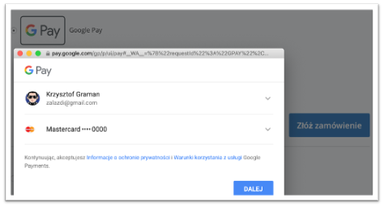

### Activating Google Pay
Google Pay is **default activated and always displayed** as a separate payment method.

## Automatic payments

One Click Payments – **One Click Payment** – is another way to make convenient card payments. They allow you to make quick payments without the need for the customer to enter all the card credentials each time. The payment process involves a single authorisation of the card payment and allocation of the card details to a specific customer. The first transaction is secured with the 3D-Secure protocol, while subsequent transactions are processed on the basis of the card debit request sent by the partner.
Automatic payment is available only to logged-in customers of your store.

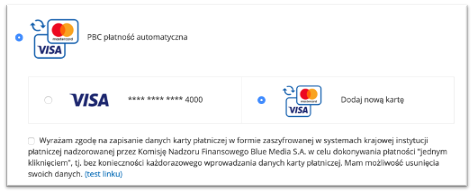

### Activate automatic payments

1. Go to **module configuraation**.
2. Fill **Autopay Agreement** with the appropriate terms and conditions - to be accepted by the customer.
3. Go to edit the channel with ID *1503* and type *Płatność automatyczna*.
4. Set **Is separated method** optioon.
5. [Refresh cache](#refresh-cache)


### Card management
The payment card will be stored and linked to the customer's account during the first correctly executed transaction using automatic payment and acceptance of the terms of service.

The customer can remove the stored cards from his/her account in your online store - he/she only has to:
1. Log in.
2. Go to **My account** from the top menu.
3. Choose **Saved payment cards** from the menu on the left. He/she will then see a list of saved cards:
   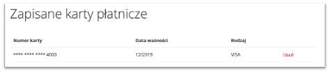
5. Click **Remove** and confirm.

## Generating orders from the administration panel
The module allows you to send a link to the payment to the customer for orders created directly in the administration panel. To do this, select the payment method **BM** when creating an order.

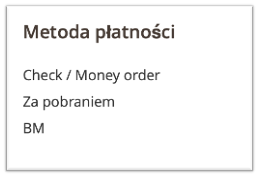

Payment link will be sent by BM to the e-mail address visible in the client's data.

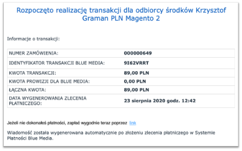

## E-mail templates
For messages:
- email_creditmemo_set_template_vars_before
- email_invoice_set_template_vars_before
- email_order_set_template_vars_before
- email_shipment_set_template_vars_before
module extends the list of available variables with **payment_channel**. Example usage in the template:
`{{var payment_channel|raw}}`

## Redirection waiting page
The module allows you to add an intermediate page, displayed before the user is redirected to the payment itself. This feature can be used for example for e-commerce tracking in Google Analytics.

Template used: `view/frontend/template/redirect.phtml`

### Activation
To activate the redirection waiting page:

1. Go to [Module configuration](#configuration).
2. Select **Enable** for **Show waiting page before redirect** option.
3. Fill **Seconds to wait before redirect** – to specify how long the page should be displayed.
4. [Refresh cache](#refresh-cache)

## Refunds
The module allows you to refund money directly to the customer's account from which the payment was sent, via a **Credit Memo on-line** and directly from the order.

### Via a Credit Memo on-line
To refund this way:
1. Go to **Invoice** details for the order.
2. Click **Credit Memo** in the top menu.
3. Complete the form with the number of items to be refunded and the charges.
4. Click **Refund** to confirm the action.

The refund will be generated automatically.

### Direct refund
This option allows you to refund money directly to the customer's account from which the payment was sent. To use this option:

1. Go to [Module configuration](#configuration) and check **Enable** for **Show manual BM refund in order details** option. This will make this action available for all completed orders paid through this module.
2. Go to the order details.
3. If the order was paid using the BM payment method, you should see the "BM return" button in the top menu.
   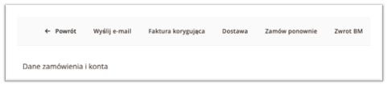
4. When you click it, you will see a window that allows you to make a full or partial refund.
    1. For a partial refund, enter the amount in the format "000.00" (dot as decimal separator).
5. Confirm the refund request by clicking **OK**, and a message will appear confirming that the refund has been processed or why it failed
6. Information about the return is visible:
   1. in the order comments
   
      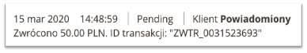
   2. on the transaction list
   
      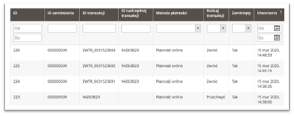


## Delivery to multiple addresses (multishipping)
This module allows you to pay for orders placed using the multishipping functionality.
Configure the delivery according to [documentation](https://docs.magento.com/user-guide/configuration/sales/multishipping-settings.html).

The payment module itself does not require any additional steps. BM payments will be available immediately.

**NOTE!**

The module in multishipping mode supports ONLY the display of available payment channels on the store page and automatic payments. It is not possible to run iFrame, Google Pay and BLIK 0 payments.
For multishipping orders, the OrderID in messages to the customer and in the oplacasie.bm.pl panel will be the cart number with the QUOTE_ prefix, not the order number.

## Information about payment
Information about the payment channel selected by the customer is visible from the Order grid.
To do this, add a column **Payment Channel**.  
The text information about the payment channel will be visible in the table.

Information about the selected payment channel is stored in the database:
- in the **blue_gateway_id** (channel id) and **payment_channel** (channel name) column in the **sales_order** table,
- in the **payment_channel** (channel name) column in the **sales_order_grid** table.

## Custom event
Option available since version 2.19.0.

When a new payment status is received - one of the events is triggered:
- `bluemedia_payment_failure` - payment failed,
- `bluemedia_payment_pending` - payment pending,
- `bluemedia_payment_success` - payment success.

Events are triggered when a new order status is saved.
Provided event data:
- `order` - `\Magento\Sales\Model\Order` instance
- `payment` - `\Magento\Sales\Model\OrderPayment` instance
- `transaction_id` - `string` transaction identifier in BlueMedia system


## Promoting installments payments

### Why promote?
- More sales
- Fewer abandoned shopping carts
- More customers

Customers are more likely to decide to buy products, even at a higher price, if they can pay later or spread the repayment in installments.

The option is available only if **Purchase Now, Pay Later** (Smartney), **Alior Installments** or **Buy on tailored installments** payments are available for the service.    
The option is triggered automatically only for new module installations - in case of updates, go to manual configuration.

### Configuration
1. Go to [Module configuration](#configuration).
2. In tab **Promoting payments** set up in which places promoting payments should be visible.
   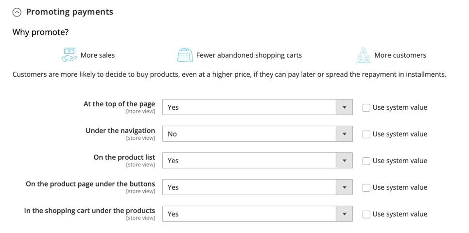

### Example visualization
**At the top of the page**  
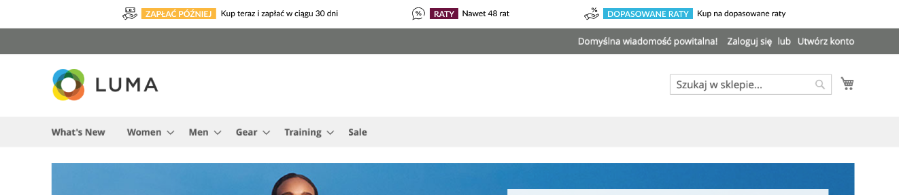

**Under the navigation**  


**On the product list**   
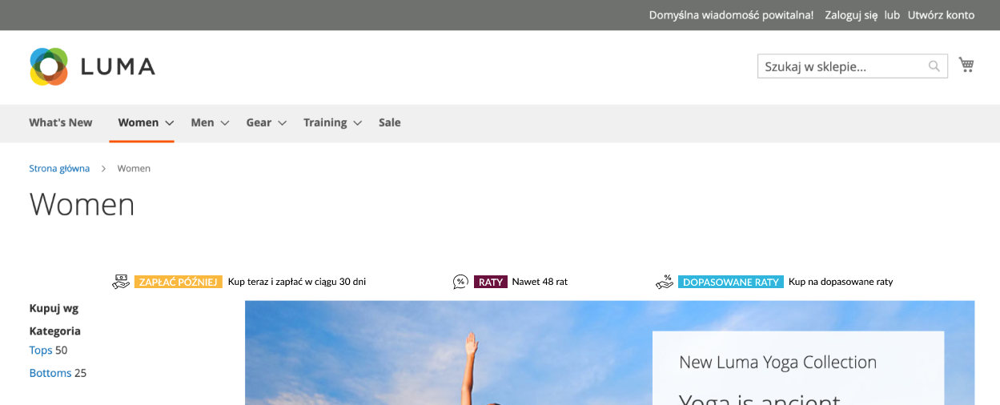

**On the product page under the buttons**  
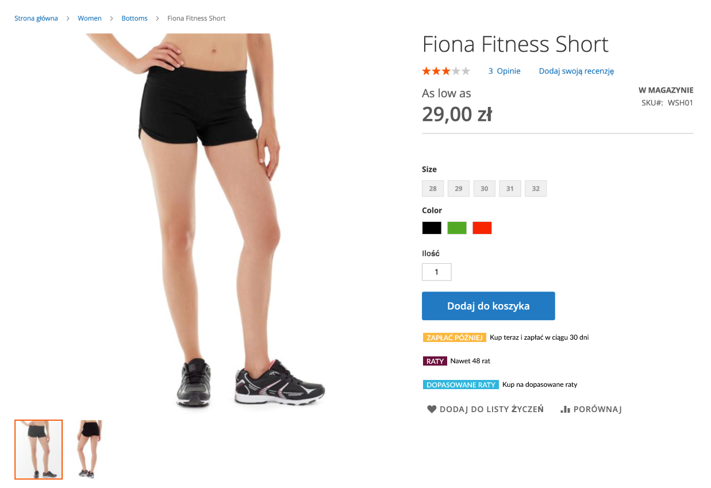

**In the shopping cart under the products**  
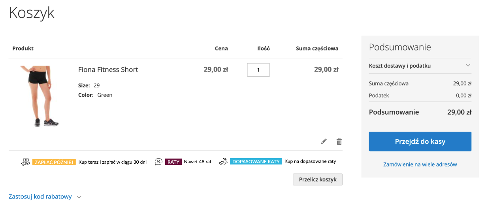


## Integration with GraphQL and Magento PWA
GraphQL module is available at:
https://github.com/bluepayment-plugin/module-bluepayment-graphql

PWA Studio module is available at: 
https://github.com/bluepayment-plugin/bluepayment-pwa-studio

## Update

### Via composer
1. Execute commands:
```bash
composer update bluepayment-plugin/module-bluepayment
bin/magento setup:upgrade
bin/magento setup:di:compile
bin/magento cache:flush
```

### Via the zip package
1. Download the latest version of the plugin from this [site](https://github.com/bluepayment-plugin/magento-2.x-plugin/archive/refs/heads/master.zip).
2. Upload the zip file to your Magento root directory.
3. While in the Magento root directory, run the following commands:
```bash
unzip -o -d app/code/BlueMedia/BluePayment bm-bluepayment-*.zip && rm bm-bluepayment-*.zip
bin/magento setup:upgrade
bin/magento setup:di:compile
bin/magento cache:flush
```
4. The module is already active.

## Deactivate module

### Deactivate with the command line
1. while in the Magento root directory, run the following commands:
```bash
bin/magento module:disable BlueMedia_BluePayment --clear-static-content
bin/magento setup:upgrade
bin/magento setup:di:compile
bin/magento cache:flush
```

### Deactivation through the admin panel (only up to Magneto 2.3 version)
1. While logged into the admin panel, select **System** -> **Web Setup Wizard** from the main menu. The system will ask you to log in again. 
2. Go to Component Manager and find the **BlueMedia/BluePayment** module in the list and click **Select** and then **Disable**.

   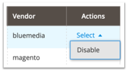
3. Click **Start Readiness Check** to initiate the dependency check and then click **Next**.
4. if you wish, you can back up your code, media, and database at this point by clicking **Create Backup**.

   
5. Once the backup is done (or unchecked) - click **Next** to proceed.
6. Click **Disable** to deactivate the store.
7. Deactivation may take a few minutes. When it is successful, you will see the following message:
   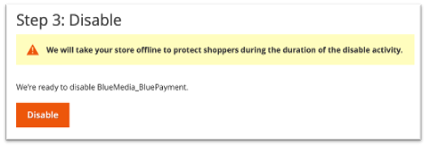

### Clean up the files and database (optional)
1. While in the Magento root directory - delete the directory: `app/code/BlueMedia`
2. Make the following database queries:
```sql
DROP TABLE blue_card;
DROP TABLE blue_gateway;
DROP TABLE blue_refund;
DROP TABLE blue_transaction;
```
3. To delete the entire module configuration - make the following database query:
```sql
DELETE FROM core_config_data WHERE path LIKE 'payment/bluepayment%';
```
